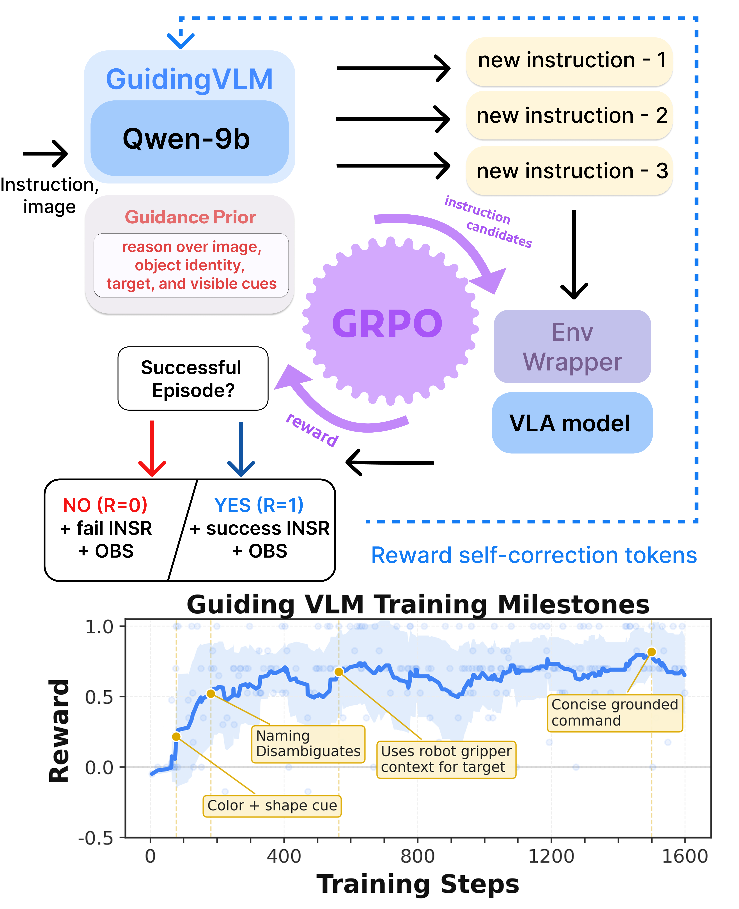

# VLA Grounder

Official implementation of [*VLA Grounder: Language-Conditioning Space Optimization for Black-Box VLA Models*](https://arxiv.org/abs/2607.04517).

[Project page](https://cognitiveaisystems.github.io/VLA-Grounder/) · [OpenReview](https://openreview.net/forum?id=LyKpta1bJ0) · [arXiv](https://arxiv.org/abs/2607.04517)

VLA Grounder learns to rewrite a task instruction into a concise command for a frozen vision-language-action policy. The grounder is trained with Group Relative Policy Optimization (GRPO) using sparse rewards from complete robot rollouts; the downstream π0 or OpenVLA policy is never updated.



## Installation

Clone the repository with its benchmark submodules:

```bash
git clone --recurse-submodules https://github.com/CognitiveAISystems/VLA-Grounder.git
cd VLA-Grounder
```

Build and enter the container:

```bash
docker/build.sh
docker/start.sh
docker/exec.sh
```

Python packages are installed after the container starts:

```bash
scripts/install.sh
```

The installation creates two virtual environments because the frozen VLA implementations and Qwen3.5/GRPO require incompatible versions of PyTorch and Transformers:

- `envs/vla-grounder` contains ManiSkill, SimplerEnv, π0, and OpenVLA.
- `envs/grpo` contains Qwen3.5, PEFT, and TRL.

Baseline evaluation without a grounder requires only the first environment:

```bash
scripts/install.sh --eval-only
```

Exact package versions are recorded in `requirements.lock` and `requirements-training.lock`. Runtime dependencies are intentionally installed by `scripts/install.sh`, not through the package metadata, because the two environments require incompatible dependency stacks.

### Assets and model weights

The benchmark scenes and assets come from the pinned [BlindVLA](https://github.com/CognitiveAISystems/BlindVLA) and [RL4VLA](https://github.com/gen-robot/RL4VLA) submodules. Install the required asset links with:

```bash
scripts/install_assets.sh
```

The container reads models from a read-only Hugging Face cache and runs with offline loading enabled. Set `HF_HOME` before starting it and download the models to that cache on the host:

```bash
export HF_HOME=/path/to/huggingface/cache
hf download Qwen/Qwen3.5-9B
hf download juexzz/INTACT-pi0-finetune-bridge
hf download gen-robot/openvla-7b-rlvla-rl
hf download Damirchik/vla-grounder-qwen3.5-9b-vl-think-pi0
```

Download the grounder checkpoint selected in the evaluation configuration. Private or gated models require a Hugging Face token on the host.

## Training

The article experiments are defined by four configurations:

```bash
scripts/train.sh configs/train/vl_think_pi0.yaml
scripts/train.sh configs/train/vl_think_openvla.yaml
scripts/train.sh configs/train/rl4vla_pi0.yaml
scripts/train.sh configs/train/rl4vla_openvla.yaml
```

The provided configurations use one GPU for frozen-VLA rollouts and one GPU for GRPO. Set `environment.device` and `model.device` to the desired device indices. Checkpoints are saved every 400 steps for VL-Think and every 300 steps for RL4VLA. Training follows `training.max_steps`; when this exceeds the number of samples collected at startup, the Trainer continues over the same rollout dataset in the next epoch.

Three rollout modes reproduce the execution schemes used in the experiments:

- `single` keeps one simulator batch for one scene.
- `efficient` shares one frozen policy and recreates the simulator batch for each rollout.
- `parallel` shares one frozen policy and retains one simulator batch per scene.

Within each GRPO group, all generated commands use the same scene, split, episode ID, and initial object configuration. The implementation also retains the original command parsing and repeated-policy-rollout (RPP) behavior used in the experiments.

## Evaluation

Run the three-seed benchmark suites with:

```bash
scripts/evaluate.sh configs/eval/vl_think_pi0.yaml
scripts/evaluate.sh configs/eval/rl4vla_pi0.yaml
scripts/evaluate.sh configs/eval/vl_think_openvla.yaml
scripts/evaluate.sh configs/eval/rl4vla_openvla.yaml
```

VL-Think evaluates Arrow, Color, Laundry, Public Info, Shape, Traffic, and Weather. RL4VLA evaluates MultiCarrot and MultiPlate. Each scene and seed loads a fresh frozen VLA policy and writes a YAML result with episode IDs, parsed commands, outcomes, and aggregate metrics. Evaluation does not record videos.

Run the frozen-VLA baselines without installing the GRPO environment:

```bash
scripts/evaluate.sh configs/eval/vl_think_pi0_baseline.yaml
scripts/evaluate.sh configs/eval/rl4vla_pi0_baseline.yaml
scripts/evaluate.sh configs/eval/vl_think_openvla_baseline.yaml
scripts/evaluate.sh configs/eval/rl4vla_openvla_baseline.yaml
```

Baseline configurations contain only `grounder.enabled: false`; model and checkpoint fields are not required.

## Merging LoRA checkpoints

Merge a training adapter into a standalone Qwen3.5 checkpoint with:

```bash
scripts/merge_lora.sh \
  --adapter outputs/train/rl4vla_pi0/checkpoint-1200 \
  --output outputs/merged/rl4vla_pi0
```

The base model is read from `adapter_config.json`; pass `--base-model` to override it. Evaluation accepts either an adapter or a merged checkpoint through `grounder.checkpoint`.

## Published checkpoints

| Benchmark | Reward VLA | Checkpoint |
| --- | --- | --- |
| VL-Think | π0 | [vla-grounder-qwen3.5-9b-vl-think-pi0](https://huggingface.co/Damirchik/vla-grounder-qwen3.5-9b-vl-think-pi0) |
| VL-Think | OpenVLA | [vla-grounder-qwen3.5-9b-vl-think-openvla](https://huggingface.co/Damirchik/vla-grounder-qwen3.5-9b-vl-think-openvla) |
| RL4VLA | π0 | [vla-grounder-qwen3.5-9b-rl4vla-pi0](https://huggingface.co/Damirchik/vla-grounder-qwen3.5-9b-rl4vla-pi0) |
| RL4VLA | OpenVLA | [vla-grounder-qwen3.5-9b-rl4vla-openvla](https://huggingface.co/Damirchik/vla-grounder-qwen3.5-9b-rl4vla-openvla) |

## Visual inspection

Selected commands can be recorded as a grid of raw environment frames:

```bash
scripts/record_video.sh \
  --config configs/eval/rl4vla_pi0.yaml \
  --scene PutOnPlateInScene25MultiCarrot-v1 \
  --prompts prompts.txt \
  --output outputs/multicarrot.mp4
```

## Citation

```bibtex
@inproceedings{shodievvla,
  title={VLA Grounder: Language-Conditioning Space Optimization for Black-Box VLA Models},
  author={Shodiev, Damir and Staroverov, Aleksei and Kachaev, Nikita and Kovalev, Alexey and Panov, Aleksandr},
  booktitle={Decision-Making from Offline Datasets to Online Adaptation: Black-Box Optimization to Reinforcement Learning}
}
```

## Acknowledgements

This code builds on [BlindVLA](https://github.com/CognitiveAISystems/BlindVLA), [RL4VLA](https://github.com/gen-robot/RL4VLA), [INT-ACT](https://github.com/ai4ce/INT-ACT), [ManiSkill](https://github.com/haosulab/ManiSkill), [SimplerEnv](https://github.com/simpler-env/SimplerEnv), [LeRobot](https://github.com/huggingface/lerobot), and [OpenVLA](https://github.com/openvla/openvla). The π0 policy wrapper and supporting pipeline code under `third_party/` are adapted from INT-ACT. The experiments use [Qwen3.5-9B](https://huggingface.co/Qwen/Qwen3.5-9B), [INT-ACT π0](https://huggingface.co/juexzz/INTACT-pi0-finetune-bridge), and the [RL4VLA OpenVLA checkpoint](https://huggingface.co/gen-robot/openvla-7b-rlvla-rl). We thank the authors for making their code, environments, assets, and models available.

## License

Except for the third-party components identified below, this repository is released under the [Apache License 2.0](LICENSE). Third-party components retain their original terms. In particular, the files under `third_party/agent`, `third_party/experiments`, and `third_party/utils` are derived from [INT-ACT](https://github.com/ai4ce/INT-ACT), remain copyright of their original authors, and are not covered by this repository's Apache-2.0 license. See [`third_party/NOTICE`](third_party/NOTICE) for provenance details.
